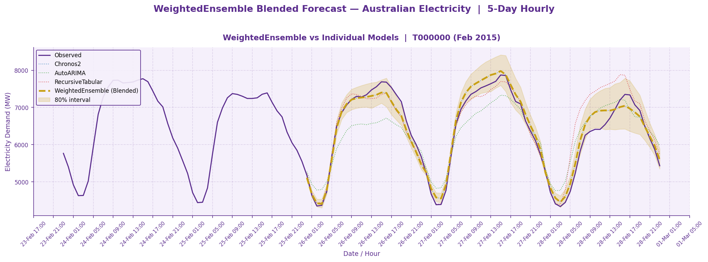
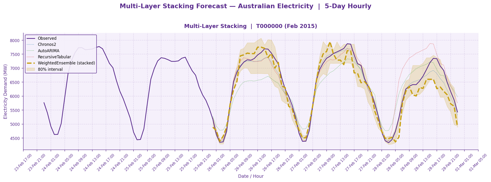
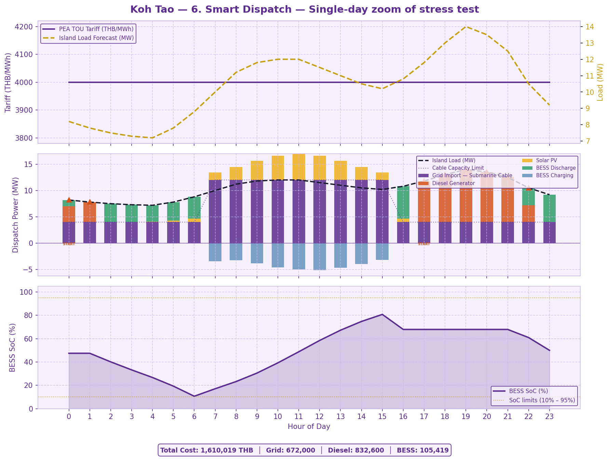

# Grid Guardian — AI Load Forecasting + Dispatch Schedule Optimization

A hackathon project for the **Provincial Electricity Authority (PEA) of Thailand** that pairs **24-hour energy load forecasting** (AutoGluon — Chronos-2 + AutoARIMA + XGBoost, blended via WeightedEnsemble / nonlinear stacking) with a **Mixed-Integer Linear Program (Pyomo + HiGHS)** that produces minimum-cost hourly dispatch schedules across grid import, diesel generation, BESS, and PV. Validated end-to-end on a **Koh Tao resort-island microgrid** case study (5–10 MW load, 33 kV submarine cable, 10 MW diesel, 50 MWh / 10 MW BESS).

---

## Problem Statement


Koh Tao sits at the tail end of a 33 kV submarine cable chain (mainland → Samui → Phangan → Tao). During peak tourist season, upstream demand on Samui and Phangan leaves Koh Tao with highly volatile residual capacity (0–16 MW) against a local load of 5–10 MW — sometimes none at all.

- **Cost gap:** When the grid supply is short, local diesel generation (10 MW) runs at **13–14 THB/unit** while electricity is sold at the **~4 THB/unit** retail tariff — a structural ~10 THB/unit loss every time the diesels fire.
- **Operator burden (Persona P1):** The Dispatch Control Center in Nakhon Si Thammarat manages six provinces 24/7; manually triaging Koh Tao outages on top of that drives operator fatigue.

**Smart EMS** forecasts the bottleneck hours ahead, charges the **50 MWh BESS** when the grid is cheap and abundant, and dispatches diesel only when truly unavoidable — closing the THB/unit gap while keeping the island stable.

---

## Architecture

```
Raw Data (30-min intervals)
        │
        ▼
Resample → 1H Hourly
        │
        ▼
Train / Test Split (3 × 24h backtest windows)
        │
        ├──────────────────────────────────────────────────────────┐
        │  training/section_a_ensemble.py                          │
        │  ┌──────────────────────────────────────────────────┐    │
        │  │  Section A: Base Model Forecasting               │    │
        │  │  Chronos-2 · AutoARIMA · RecursiveTabular (XGB)  │    │
        │  ├──────────────────────────────────────────────────┤    │
        │  │  Section A2: WeightedEnsemble (blended)          │    │
        │  └──────────────────────────────────────────────────┘    │
        │                                                          │
        ├──────────────────────────────────────────────────────────┤
        │  training/section_b_stacking.py                          │
        │  ┌──────────────────────────────────────────────────┐    │
        │  │  Section B: Multi-Layer Nonlinear Stacking       │    │
        │  │  TabularEnsemble · PerQuantileTabularEnsemble    │    │
        │  │  (LightGBM meta-learner on base model outputs)   │    │
        │  └──────────────────────────────────────────────────┘    │
        └──────────────────────────────────────────────────────────┘
                              │
                              ▼
                    AutogluonModels/ (saved predictors)
                              │
                              ▼
                    ┌─────────────────────────────┐
                    │   24-h Load Forecast (MW)   │
                    └──────────────┬──────────────┘
                                   ▼
                    ┌─────────────────────────────┐
                    │  app/optimizer.py           │
                    │  Pyomo MILP — HiGHS solver  │
                    │  · Unit commitment (diesel) │
                    │  · BESS SoC tracking        │
                    │  · Dynamic cable cap        │
                    │  · Reserve margin           │
                    └──────────────┬──────────────┘
                                   ▼
                    ┌─────────────────────────────┐
                    │  Optimal Dispatch Schedule  │
                    │  Grid · Diesel · BESS · PV  │
                    └─────────────────────────────┘
                                   │
                                   ▼
                         app/main.py (FastAPI)
                    ┌──────────────────────────────┐
                    │  POST /forecast       │ single zone forecast
                    │  POST /forecast/batch │ up to 50 zones
                    │  POST /optimize       │ forecast + dispatch Schedule MILP
                    │  GET  /models         │ leaderboard
                    └──────────────────────────────┘
```

---

## Setup

**Requirements:** Python 3.12, [uv](https://github.com/astral-sh/uv)

```bash
cd grid-guardian
uv sync   # installs AutoGluon, FastAPI, Pyomo, HiGHS (highspy)
```

---

## Run Experiments

```bash
# Section A + A2: Zero-shot comparison + WeightedEnsemble
uv run python training/section_a_ensemble.py

# Section B: Nonlinear stacking
uv run python training/section_b_stacking.py

# Microgrid optimizer — runs all 6 Koh Tao dispatch scenarios standalone
uv run python app/optimizer.py
```

Each script saves PNG charts under `outputs/` and prints a leaderboard / scenario summary to stdout.

---

## API — Real-time Inference & Optimization

Start the server:

```bash
uv run uvicorn app.main:app --reload --port 8000
```

Swagger UI: **http://localhost:8000/docs**

### Endpoints

| Method | Path | Description |
|--------|------|-------------|
| `GET`  | `/`               | Health check — best model, prediction length, available models |
| `GET`  | `/models`         | Leaderboard scores for all trained models |
| `POST` | `/forecast`       | Real-time inference — single zone, 24-hour horizon |
| `POST` | `/forecast/batch` | Batch inference — up to 50 zones in one call |
| `POST` | `/optimize`       | Forecast + MILP dispatch — minimum-cost schedule for grid / diesel / BESS / PV |

### Sample: Forecast (`POST /forecast`)

```bash
curl -X POST http://localhost:8000/forecast \
  -H "Content-Type: application/json" \
  -d '{
    "item_id": "Zone1",
    "model": "WeightedEnsemble",
    "history": [
      {"timestamp": "2015-02-24T00:00:00", "target": 5200},
      {"timestamp": "2015-02-24T01:00:00", "target": 4900}
    ]
  }'
```

### Sample: Optimize (`POST /optimize`)

Internally runs a load forecast, then solves the dispatch MILP. All optional fields fall back to built-in defaults.

```bash
curl -X POST http://localhost:8000/optimize \
  -H "Content-Type: application/json" \
  -d '{
    "item_id": "KohTao",
    "history": [ /* ≥ 24 hourly observations */ ],
    "pv_forecast": [0,0,0,0,0,0, 0.5,1.5,2.5,3.5,4.5,5.0,
                    4.8,4.0,3.0,1.8,0.8,0, 0,0,0,0,0,0],
    "tou_prices": [4000, 4000, /* ... 24 values ... */ ],
    "config": {
      "P_gen_max": 10.0, "fuel_cost_var": 13000.0,
      "bess_capacity": 50.0, "bess_p_max": 10.0,
      "p_grid_max": 16.0
    }
  }'
```

The response contains `total_cost_thb`, `dispatch[]` (per-hour `p_grid_mw`, `p_gen_mw`, `gen_online`, `p_charge_mw`, `p_discharge_mw`, `soc`, costs), and `load_forecast_used`.

---

## Model Results

Dataset: **Australian Electricity Subset** (resampled to 1H, 5 time series)
Metric: **WQL — Weighted Quantile Loss** (lower is better)

| Model | Score (test) | Type |
|-------|-------------|------|
| **Chronos-2** | **-0.029** | Foundation model (zero-shot) |
| RecursiveTabular (XGB) | -0.038 | Tree-based |
| AutoARIMA | -0.071 | Classical statistical |
| **WeightedEnsemble** | **best** | Blended (Chronos-2 + XGB + ARIMA) |

**Key finding:** Chronos-2 achieves the best zero-shot score — outperforming both XGBoost and AutoARIMA which were trained on the dataset. The `WeightedEnsemble` further improves by learning optimal blending weights.

### Section A2 — WeightedEnsemble vs Individual Models



### Section B — Multi-Layer Nonlinear Stacking



---

## Microgrid Optimization — Koh Tao Case Study

The optimizer in [app/optimizer.py](app/optimizer.py) consumes the 24-hour load forecast and solves a **Mixed-Integer Linear Program** (Pyomo + HiGHS / `appsi_highs`):

```
min  Σₜ  P_gen·fuel_var + fuel_noload·u_gen + startup_cost·v_start    (C_DG)
       + P_grid·TOU                                                   (C_GRID)
       + (P_ch + P_dis)·bess_op_cost                                  (C_BESS)
       + P_shed·VOLL                                                  (C_PENALTY)

s.t.  power balance · diesel unit commitment · BESS SoC tracking
      mutex charge/discharge · 15% reserve margin · dynamic cable cap
      terminal SoC ≥ initial SoC
```

**Modelled hardware** (Koh Tao real specs — see [app/optimizer.py:25-52](app/optimizer.py#L25-L52)):

| Asset | Spec |
|---|---|
| Island load | 5–10 MW (resort island, evening peak) |
| Submarine cable | 33 kV XLPE, 16 MW thermal limit |
| Diesel genset | 10 MW, 13 THB/kWh fuel, 30k THB cold-start |
| BESS | 50 MWh / 10 MW (C/5), 95% RTE, 10–95% SoC band |
| Grid tariff | 4,000 THB/MWh (PEA flat) |

### Scenario results

Six scenarios are solved end-to-end by `uv run python app/optimizer.py`. All horizons are MILP-feasible with **zero load shedding**.

| # | Scenario | Horizon | Cable cap | Total (THB) | Diesel (MWh) | Shed |
|---|---|:---:|:---:|---:|---:|:---:|
| 1 | Normal — cable healthy | 24 h | 16 MW | 716,400 | 0 | 0 |
| 2 | N-1 cable derated | 24 h | 6 MW | 1,198,248 | 36.2 | 0 |
| 3 | Island mode (cable failure) | 24 h | 0 MW | 2,550,300 | 179.1 | 0 |
| 4 | Perfect Storm (PV + 18–22h bottleneck) | 24 h | 4–12 MW dyn. | 1,287,324 | 23.3 | 0 |
| 5 | Historical stress test, Mar 27–31 2026 | 120 h | 4–12 MW dyn. | 7,882,097 | 272.5 | 0 |
| 6 | Smart dispatch — single-day zoom of #5 | 24 h | 4–12 MW dyn. | 1,610,019 | 54.5 | 0 |

**Reliability value of the 33 kV cable** (Normal vs Island): **~1.83 M THB/day**.

### Featured chart — Scenario 6 (Smart Dispatch)



*Single-day zoom of the high-season stress profile. The optimizer pre-charges the BESS from cheap morning grid + midday PV, then discharges hard during the 18:00–22:00 cable bottleneck — firing the diesel only to cover the 14 MW evening peak.*

For the full mathematical formulation, constraint-by-constraint write-up, and per-scenario charts, see **[docs/OPTIMIZATION_REPORT.md](docs/OPTIMIZATION_REPORT.md)**.

---

## Output Artifacts

| File | Description |
|------|-------------|
| `outputs/forecasting/section_a_forecast.png` | Per-model forecast vs observed (PEA theme) |
| `outputs/forecasting/section_a2_ensemble.png` | WeightedEnsemble vs individual models |
| `outputs/forecasting/section_b_stacking.png` | Nonlinear stacked ensemble vs base models |
| `outputs/optimization/kohtao_scenario6_smart_dispatch.png` | Featured single-day dispatch chart |
| `docs/OPTIMIZATION_REPORT.md` | Full optimization write-up (formulation + all 6 scenarios) |
| `AutogluonModels/` | Saved AutoGluon predictor artifacts |

---

## Tech Stack

| Layer | Technology |
|-------|-----------|
| Language | Python 3.12 |
| Package manager | uv |
| Forecasting framework | AutoGluon TimeSeries |
| Foundation model | Amazon Chronos-2 |
| Classical model | AutoARIMA (statsforecast) |
| Tree-based model | XGBoost via RecursiveTabular |
| Ensemble | WeightedEnsemble / TabularEnsemble (LightGBM) |
| Optimization | Pyomo + HiGHS (`appsi_highs` / `highspy`) |
| API framework | FastAPI + uvicorn (async) |
| Visualisation | Matplotlib (PEA Thailand brand theme) |
